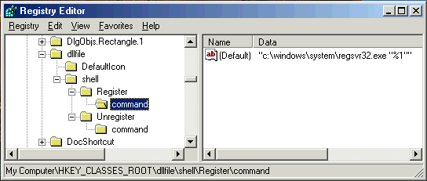



## Context Menu \(Un\)Register OCX and DLL

### Description

I'm still new to creating ActiveX DLL. After downloading some DLL plugin samples from Planet-Source-Code i found that some of the codes need to register the DLL manually (that is typing "c:\windows\system\regsvr32.exe DLLFILENAME" in MS-DOS prompt) or an extra EXE is created for that purpose. Why not add an "Register DLL" option into context menu (the menu which pops up when you right click on any dll files with your mouse on right panel of Windows Explorer)?  

 
### More Info
 

             |
---                |---
**Submitted On**   |
**By**             |[Chin Huat](https://github.com/Planet-Source-Code/PSCIndex/blob/master/ByAuthor/chin-huat.md)
**Level**          |Advanced
**User Rating**    |4.6 (69 globes from 15 users)
**Compatibility**  |VB 5\.0, VB 6\.0
**Category**       |[Registry](https://github.com/Planet-Source-Code/PSCIndex/blob/master/ByCategory/registry__1-36.md)
**World**          |[Visual Basic](https://github.com/Planet-Source-Code/PSCIndex/blob/master/ByWorld/visual-basic.md)
**Archive File**   |

### Source Code

 
<ol>
<li> Click on Start Menu, choose "<b>Run</b>".
<li> Type "<b>regedit</b>" and click "<b>OK</b>".
<li> On the left panel of Registry Editor, go to :   
<i>My Computer\HKEY_CLASSES_ROOT\dllfile</i>  
(expand the tree with alot of folder icons, from "<b>My Computer</b>", then "<b>HKEY_CLASSES_ROOT</b>" and then "<b>dllfile</b>", by clicking the "<b>+</b>" sign)
<li> Right click on "<b>dllfile</b>", choose "<b>New</b>" -> "<b>Key</b>".
<li> Rename the new key to "<b>shell</b>". IT SHOULD BE AT THE SAME LEVEL AS THE "DefaultIcon" KEY!  
<li> Create another key named "<b>Register</b>" under "<b>shell</b>"
<li> On the right panel, set "<i>(Default)</i>" string value into "<i>Register DLL</i>" by double clicking on it.
<li> Create another key named "<b>command</b>" under "Register"
<li> Again, set the "<i>(Default)</i>" string value under "command" to:   
<i>C:\windows\system\regsvr32.exe "%1"</i>  
<li> Restart your computer.
<li> Now, right-click on some DLL files, there should be an extra option "<b>Register DLL</b>". Click on it.
<li> A message box will appear, displaying the success message.
</ol>
Just in case you want to add another option called "<b>Unregister DLL</b>", you can create another key named "<b>Unregister</b>" under "<b>shell</b>" ("<b>Unregister</b>" should be the same level as "<b>Register</b>") and set the "<i>(default)</i>" string value to "<i>Unregister DLL</i>". Under "<b>Unregister</b>", create another key called "<b>command</b>" and set the "<i>(default)</i>" string value to   
    <i>C:\Windows\System\RegSvr32.Exe /u "%1" </i>  
Restart your computer. "Unregister DLL" should be available in context menu. The same trick applies to all file types. Let me know if you still have any problem.  
 

<table>
<tr>
<td valign="top"><b>Note:</b></td>
<td valign="top">
<ol>
<li>To make the same option available for .OCX files, search for "<b>ocxfile</b>" key under "<b>HKEY_CLASSES_ROOT</b>" and repeat step 4 to 12
<li>Let say if you want to add a shell option to a file with extension .ABC , you must find the "<b>.ABC</b>" key under "<b>HKEY_CLASSES_ROOT</b>". Memorize the default value under the key, (eg, "<i>(Default)</i>" is set to "<i>ABCFile</i>"). Find the key with the same same as the value (in this case, the key name is "<b>ABCFile</b>"). Now repeat from step 4 to 12. IF YOU CREATE THE "shell" key under ".ABC", THINGS WILL NOT WORK OUT!
<li>Backup your registry file so that you can restore them, just in case anything worse happen. Choose "<b>Registry</b>" from the menu, then "<b>Export Registry File</b>". The rest should be self explainable.
<li>Windows ME (and 2000?) already have this built-in function. The "<b>Open With</b>" context menu option now contains "<b>Microsoft(C) Register Server</b>". Clicking on it will register the DLL only but not unregister it!
</td>
</tr>
</table>

